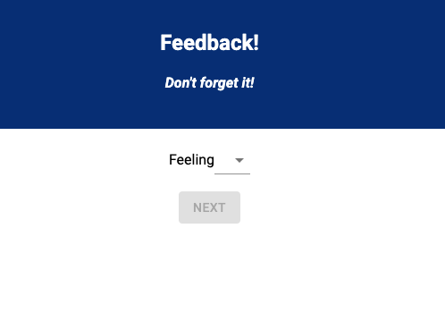

# Redux Feedback Loop
Duration: 1-2 Hours  
  
Description: A simple feedback loop application.

# Prerequisites
This project uses the following:
* [Node.js](https://nodejs.org/en/download/)
* [Postgresql](https://www.postgresql.org/download/)

# Recommended Dependencies

The following are recommended out of convenience:
* [Postico](https://eggerapps.at/postico/)

# Installation

1. Download or clone the source code.
2. Open the project in your favorite editor, 
3. Pull up the project location in a terminal.
4. Run `npm install` in the terminal.
5. Run `npm start` in the terminal.

# Usage

1. Follow the on-screen prompts to input the 3 mandatory scores and optional comment(s).
2. Use the back button at any time to revise an entry.
3. Review your feedback.
4. Submit your feedback.
5. You may optionally leave another response.

# Built With

* [Express.js](https://expressjs.com/)
* [Postgresql](https://www.postgresql.org/)
* [Material-UI](https://www.npmjs.com/package/@mui/material)
* [React](https://reactjs.org/)
* [React Router](https://reactrouter.com/)
* [Redux](https://redux.js.org/)

# Impediments & Improvements

Improvements:
* A progress indicator for users providing feedback.
* A password-protected administrative dashboard.
* Further componentization for greater flexibility and potential customization.
* Restructure as a modal component.
* Additional CSS, such as transition effects.
* Method to try and attach it to a specific user (i.e. cookies or a user login).

Impediments:
* (2/7/22) Packages such as material-ui/core and material-ui/icons have been depreciated.

# Acknowledgement
Thanks to Prime Digital Academy.
